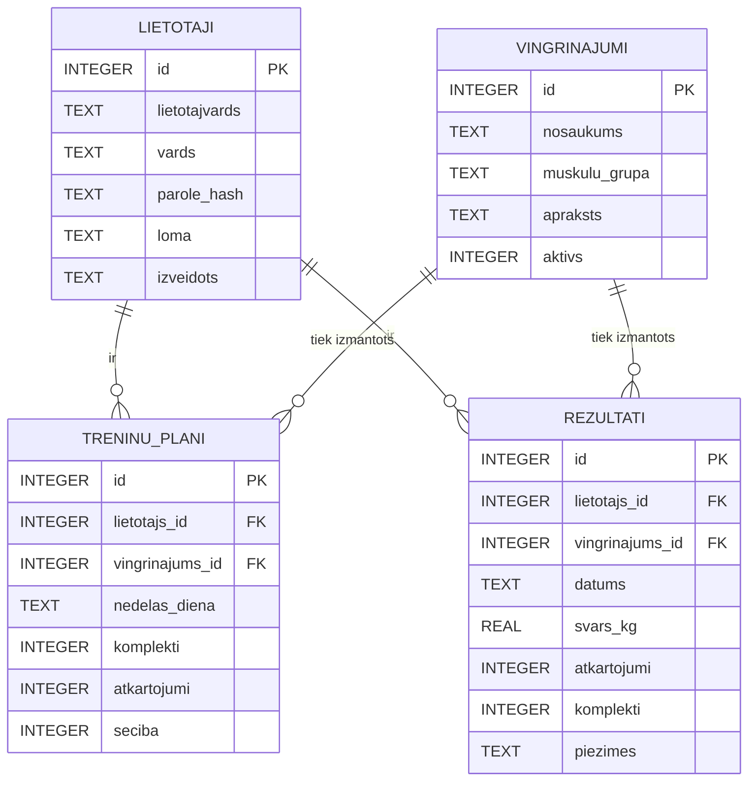

# ER modelis

```mermaid
erDiagram
    LIETOTAJI ||--o{ TRENINU_PLANI : "ir"
    LIETOTAJI ||--o{ REZULTATI : "ir"
    VINGRINAJUMI ||--o{ TRENINU_PLANI : "tiek izmantots"
    VINGRINAJUMI ||--o{ REZULTATI : "tiek izmantots"

    LIETOTAJI {
        INTEGER id PK
        TEXT lietotajvards
        TEXT vards
        TEXT parole_hash
        TEXT loma
        TEXT izveidots
    }

    VINGRINAJUMI {
        INTEGER id PK
        TEXT nosaukums
        TEXT muskulu_grupa
        TEXT apraksts
        INTEGER aktivs
    }

    TRENINU_PLANI {
        INTEGER id PK
        INTEGER lietotajs_id FK
        INTEGER vingrinajums_id FK
        TEXT nedelas_diena
        INTEGER komplekti
        INTEGER atkartojumi
        INTEGER seciba
    }

    REZULTATI {
        INTEGER id PK
        INTEGER lietotajs_id FK
        INTEGER vingrinajums_id FK
        TEXT datums
        REAL svars_kg
        INTEGER atkartojumi
        INTEGER komplekti
        TEXT piezimes
    }
```
